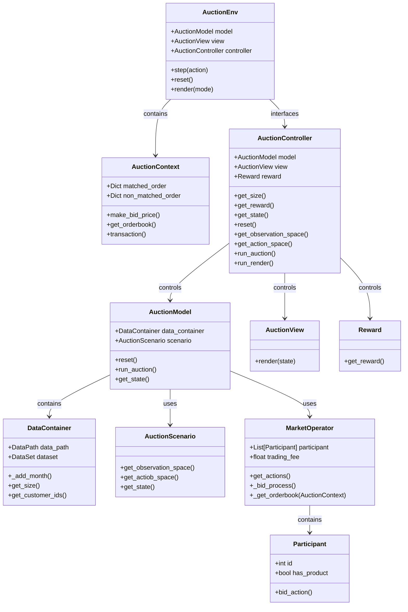

## Peer to Peer Energy Trading Simulator (In Progress)

- This simulator follows the openAI gym-like environment style.
- The simulation dataset is Household energy demand and PV generation from AusGrid.
- Some households might remain PV generations in daytime, since it has large pv modules or not uses electrical energy because of absences.
- At this time, the households can play as energy seller and other household can buy from the energy.
- Market Operator manages the P2P market process, matching sellers and buyes in order to optimize their profits.
-------

### Simulator Design (Must be revised, some contents have not been written)

----
- AuctionEnv Contains AuctionController which controls Model and View and interfaces with AuctionEnv
- Market Operator including Participants get actions to participate auction, processing bidding.
- AuctionContext can make auction mechanism such as double-sided, uniform auction. 
- AuctionScenario determines the information that each customer can be got to make decision participating auction market.

